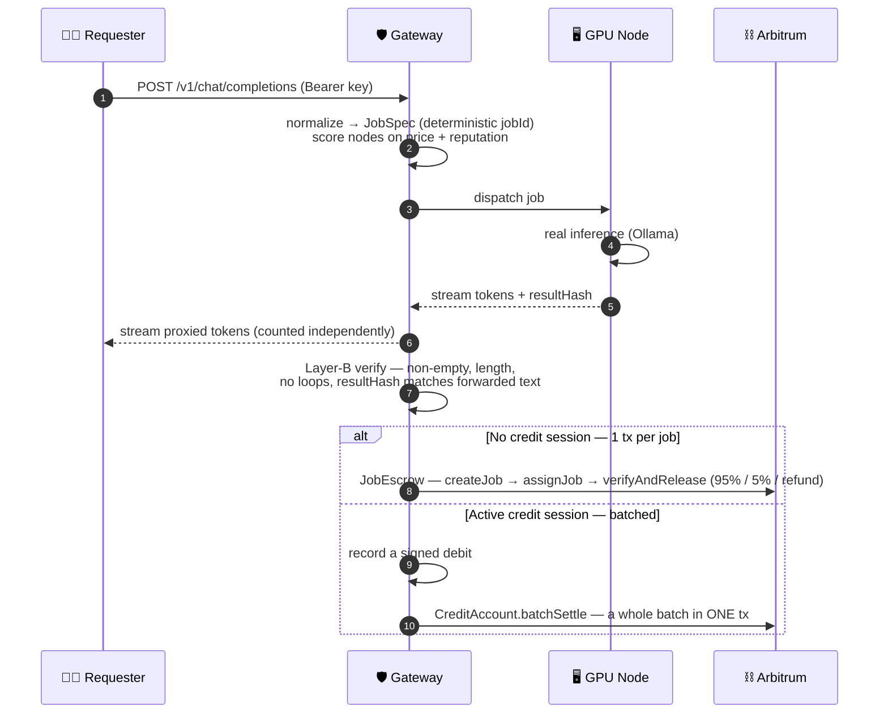

<div align="center">

# ⚡ QueraIS

### BitTorrent for AI inference

An **OpenAI-compatible API** served by independent GPU nodes that earn `$QAIS` for running LLM jobs.
Every job settles on-chain — **95% to the node · 5% protocol fee**.

[](https://github.com/ShavitR/querais/actions/workflows/ci.yml)
[](https://www.npmjs.com/package/@querais/sdk)
[](https://pypi.org/project/querais/)
[](#deployed-contracts-arbitrum-sepolia)
[](LICENSE)

**[🖥️ Web dashboard](https://gateway.querais.xyz/)** ·
**[🌐 Live status](https://gateway.querais.xyz/status)** ·
**[📦 npm](https://www.npmjs.com/org/querais)** ·
**[🐍 PyPI](https://pypi.org/project/querais/)** ·
**[📚 Docs](#project-docs)**

</div>

> [!WARNING]
> **Testnet only** (Arbitrum Sepolia) — tokens have **no real value**. Your prompts run on
> strangers' machines and ~5% are re-run for verification, so **don't send anything secret**.
> [Terms](docs/TERMS.md) · [Privacy](docs/PRIVACY.md)

---

## 🧭 Pick your path

| You want to… | Go here | Time |
|---|---|---|
| 🖥️ **Just look around** — explore the live network in your browser | [Web dashboard](#web-dashboard) | ⏱️ instant |
| 🤖 **Use the AI** — call the API from your code | [Use the hosted gateway](#use-the-live-testnet-gateway-fastest-path) | ⏱️ 2 min |
| 💸 **Earn `$QAIS`** — run a GPU node | [Run a node](#run-a-node-and-earn-testnet-qais) | ⏱️ ~5 min |
| 🛠️ **Hack on it** — run the whole stack locally | [60-second demo](#60-second-demo) | ⏱️ 5 min |

It's **live today**: gateway up 24/7 at `gateway.querais.xyz`, SDKs on
[npm](https://www.npmjs.com/org/querais) + [PyPI](https://pypi.org/project/querais/), contracts on
Arbitrum Sepolia. The trust model is a single trusted gateway for now —
[what's built](#project-status) · [what's not](#whats-not-built-yet-limitations).

---

<a id="web-dashboard"></a>

## 🖥️ Web dashboard

A full browser UI is served by the gateway at **[gateway.querais.xyz](https://gateway.querais.xyz/)** —
no install, no key needed to look around:

| View | What it shows |
|---|---|
| **Explorer** | Live network stats + node leaderboard with the 5-dimension reputation breakdown |
| **Playground** | Streaming chat with a model picker and a per-request cost readout |
| **Credit** | Deposit `$QAIS`, **sign one EIP-712 spending cap in your wallet**, watch cap-spend / headroom / pending settle live, withdraw |
| **Jobs / Usage** | Your settled jobs (with Arbiscan links) and usage against your tier |

**Sign in** two ways: paste an **API key**, or **connect a wallet** (EIP-4361 "Sign-In with
Ethereum"). The credit page is the one-screen demo of the marquee batched-settlement flow — deposit
→ sign once → fire many completions with **zero per-call wallet transactions** → settle in one tx.
The dashboard is same-origin with the API (no keys ever leave your browser in plaintext).

> Built on Vite + React, served by the gateway itself. The marketing/docs site at the root
> `querais.xyz` is coming separately.

---

<a id="project-status"></a>

<details>
<summary><strong>📊 Project status — 10 build slices shipped ✅</strong> <em>(click to expand)</em></summary>

<br/>

| Slice | What it delivers | Status |
|:-----:|------------------|:------:|
| 0 | CI green-bar gate (build · typecheck · lint · test · e2e) + Solidity lint + Slither | ✅ |
| 1 | Durable gateway state on `node:sqlite` (API keys, faucet claims, job history) | ✅ |
| 2 | **Batched settlement** — deposit once, sign one EIP-712 cap, settle thousands of jobs per tx | ✅ |
| 3 | Hardened surface (quotas, faucet anti-drain, WS flood caps) + ops (pause CLI, cold-key split) | ✅ |
| 4 | **5-dimension reputation** (accuracy/uptime/latency/longevity/stake) + daily on-chain snapshots | ✅ |
| 5 | **Layer-A semantic verification** (~5% sampled) + on-chain disputes with slashing | ✅ |
| 6 | **Tokenomics live**: ProtocolTreasury 60/20/20 sweep + burn, StakingRewards, incentives | ✅ |
| 7 | Production deploy — gateway **live 24/7 at `gateway.querais.xyz`** | ✅ |
| 8 | Observability: alerts + runbooks, review queue, metrics, public `/status` page | ✅ |
| 9 | DX & release: signed model manifest, npm/PyPI SDKs, prebuilt node releases, disclosures | ✅ |

The loop works both ways — **inference** (OpenAI request → match → real Ollama inference →
streamed result) and **settlement** (per-job escrow or batched, 95/5, with staking, slashing,
reputation). **Stage D is underway:** the [web dashboard](#web-dashboard) is live (explorer,
playground, wallet sign-in + the EIP-712 credit flow); next up are the operator/admin console,
the live network explorer, and the marketing/docs site, then the arbitration panel, scale, and
the mainnet gate. Live detail in `HANDOFF.md`.

</details>

---

<a id="use-the-live-testnet-gateway-fastest-path"></a>

## 🚀 Use the live testnet gateway (fastest path)

No clone, no build — just point an OpenAI client at the hosted gateway. **Do this:**

1. **Get an API key.** During the beta the operator issues them — ask in the project channel or
   [open an issue](https://github.com/ShavitR/querais/issues). (Self-serve signup is coming.)
2. **Install a client** — the official `openai` SDK works as-is, or use the QueraIS SDK for extras:
   ```bash
   pip install openai          # or: pip install querais   (typed client + nodes/stats/sessions)
   ```
3. **Change one line** — the base URL — and call it:

**Python** (`pip install openai`):

```python
from openai import OpenAI

client = OpenAI(base_url="https://gateway.querais.xyz/v1", api_key="sk-...your key...")
stream = client.chat.completions.create(
    model="gemma3:4b",
    messages=[{"role": "user", "content": "Explain Arbitrum in one sentence."}],
    stream=True,
)
for chunk in stream:
    print(chunk.choices[0].delta.content or "", end="", flush=True)
```

**TypeScript** (`npm i openai`):

```ts
import OpenAI from 'openai';

const client = new OpenAI({ baseURL: 'https://gateway.querais.xyz/v1', apiKey: 'sk-…' });
const stream = await client.chat.completions.create({
  model: 'gemma3:4b',
  messages: [{ role: 'user', content: 'Explain Arbitrum in one sentence.' }],
  stream: true,
});
for await (const chunk of stream) process.stdout.write(chunk.choices[0]?.delta?.content ?? '');
```

Your prompt is matched to an independent GPU node, served with real local inference, and
the job settles on-chain — watch it live at
[`https://gateway.querais.xyz/status`](https://gateway.querais.xyz/status).
`GET /v1/models` lists what the connected nodes currently serve.

Prefer a typed client over the raw OpenAI SDK? Both QueraIS SDKs are published — they wrap the
official OpenAI client and add the QueraIS extras (sessions, `nodes`, `stats`, model manifest):

```bash
pip install querais            # Python — add [langchain] or [llamaindex] for those integrations
npm i -g @querais/sdk          # TypeScript SDK + the `querais` CLI
```

> [!TIP]
> Want to **serve** jobs instead? Skip to [Run a node](#run-a-node-and-earn-testnet-qais) —
> one command (`iwr -useb https://querais.xyz/install.ps1 | iex`) installs everything and starts
> earning. Just Node 22 + Ollama.

---

<a id="prerequisites"></a>

## 🧰 Prerequisites

| Tool | Version | Why |
|------|---------|-----|
| **Node.js** | **≥ 22.13** (dev on v26) | The toolchain uses Node's built-in `node:sqlite`, which is only stable from 22.13. Node 20 will fail at install with `ERR_UNKNOWN_BUILTIN_MODULE: node:sqlite`. |
| **pnpm** | ≥ 9 (`npm i -g pnpm`) | Workspace package manager. |
| **Ollama** | latest | The inference backend. Install from [ollama.com](https://ollama.com) and make sure it's running (`ollama serve`). |

Check your Node version first: `node -v` — it must print `v22.13` or higher.

> [!NOTE]
> The unit tests and the e2e gate use a **mock** inference backend, so you can run
> `pnpm test` / `pnpm test:e2e` **without Ollama**. You only need Ollama for `pnpm demo`
> and for running a real node.

---

<a id="60-second-demo"></a>

## ⏱️ 60-second demo

This spins up a throwaway local blockchain, deploys all contracts, starts a gateway **and** a
node, runs a **real streaming completion**, prints the protocol fee earned on-chain, and leaves
a live dashboard open. Everything is self-contained on your machine.

```bash
pnpm install
pnpm build                 # compiles contracts + builds every package (required once)
ollama pull gemma3:4b      # ~3.3 GB; optional — the node auto-pulls it on first run anyway
pnpm demo
```

**What success looks like:** you'll see the prompt stream token-by-token in the terminal, a
line showing the on-chain treasury fee, and a dashboard URL like `http://127.0.0.1:8787/`.
Open it to watch live nodes, balances, and to try your own prompts in the browser.

Want just the automated proof, no browser? Run the acceptance gate:

```bash
pnpm test:e2e             # spins up its own chain, runs 18 end-to-end scenarios, tears down
```

It exercises (among others): successful settlement (95/5), a failed-verification refund +
slash, OpenAI-SDK parity, **batched settlement** (100 calls → 1 on-chain tx, 0 requester
wallet txs), the pause drill, reputation snapshots, Layer-A cheater detection, an on-chain
dispute slash, treasury sweep + burn, staking rewards, graceful drain, the alerting loop,
and the signed model manifest.

---

<a id="call-it-from-your-code-openai-drop-in"></a>

## 🔌 Call it from your code (OpenAI drop-in)

The gateway is OpenAI-compatible — point the **official OpenAI client** at it and change one
line (the base URL). You need a gateway running with a node connected; the simplest way is the
[manual stack](#run-the-full-stack-manually) below (its API key is `sk-querais-dev`, from
`.env.example`).

**Python:**
```python
from openai import OpenAI
client = OpenAI(base_url="http://127.0.0.1:8787/v1", api_key="sk-querais-dev")
r = client.chat.completions.create(
    model="gemma3:4b",
    messages=[{"role": "user", "content": "Explain Arbitrum in one sentence."}],
)
print(r.choices[0].message.content)
```

**TypeScript / JavaScript:**
```ts
import OpenAI from 'openai';
const client = new OpenAI({ baseURL: 'http://127.0.0.1:8787/v1', apiKey: 'sk-querais-dev' });
const r = await client.chat.completions.create({
  model: 'gemma3:4b',
  messages: [{ role: 'user', content: 'Explain Arbitrum in one sentence.' }],
});
console.log(r.choices[0].message.content);
```

Streaming (`stream: true`), `models.list()`, and the usage object all work — drop-in parity is
enforced by the e2e suite, which runs the real `openai` SDK against the gateway.

**Or the bundled `querais` CLI** (`npm i -g @querais/sdk`):
```bash
querais chat "Hello"   # streams a completion
querais models         # models available on the network
querais nodes          # active nodes + their reputation
```

> [!NOTE]
> **Which API key?** It's whatever the gateway was configured with.
> `pnpm dev:gateway` reads `GATEWAY_API_KEYS` from `.env` (default `sk-querais-dev`);
> `pnpm gateway:sepolia` uses `sk-host`; `pnpm demo` uses `sk-test`.

---

## 💳 Batched settlement: pay once, run thousands of jobs

By default every API call costs an on-chain transaction. **Batched settlement** removes that:
the requester deposits `$QAIS` into the `CreditAccount` contract **once**, signs a single
EIP-712 *spending cap* off-chain (zero gas), and then fires unlimited jobs. The gateway
accumulates the signed debits and settles them all in **one** `batchSettle` transaction — the
requester signs **nothing** per call, and the signed cap bounds the most the gateway could ever
spend (no way to touch your principal beyond the cap).

Using the SDK (the only extra requirement is a requester private key for the one signature):

```ts
import { QueraisClient } from '@querais/sdk';

const client = new QueraisClient({
  baseUrl: 'http://127.0.0.1:8787',
  apiKey: 'sk-querais-dev',
  privateKey: '0x…',            // requester wallet — used ONCE to sign the cap, off-chain
});

// (1) Deposit $QAIS into the CreditAccount on-chain — see GET /v1/credit/info for the address.
// (2) Open a session: sign a spending cap (zero gas) and register it.
await client.openSession({
  maxSpendWei: 10n ** 21n,                              // 1000 QAIS ceiling for this session
  nonce: 1n,
  deadline: BigInt(Math.floor(Date.now() / 1000) + 3600),
});

// (3) From now on, jobs from this key settle in batches — no per-call wallet tx.
const r = await client.chat([{ role: 'user', content: 'Hi' }], { model: 'gemma3:4b' });
```

The gateway flushes a batch once enough jobs accumulate (`GATEWAY_BATCH_FLUSH_THRESHOLD`) or on
shutdown. Verified end-to-end in `pnpm test:e2e`: **10 jobs → 1 on-chain `batchSettle` → 0
requester transactions**, with the 95/5 split landing on-chain.

---

<a id="run-the-full-stack-manually"></a>

## 🛠️ Run the full stack manually

For development you can run each piece in its own terminal (so the gateway stays up for you to
hit from code). From the repo root:

```bash
# one-time
pnpm install && pnpm build
cp .env.example .env          # the defaults are Hardhat dev accounts — fine for localhost

# terminal 1 — local blockchain
pnpm chain

# terminal 2 — deploy all contracts to the local chain
pnpm deploy:local

# terminal 3 — the gateway (OpenAI API on http://127.0.0.1:8787, dashboard at /)
pnpm dev:gateway

# terminal 4 — a node daemon (needs Ollama running with the model)
pnpm dev:daemon
```

Now hit `http://127.0.0.1:8787/v1` with the [drop-in examples above](#call-it-from-your-code-openai-drop-in)
(key `sk-querais-dev`).

---

<a id="run-a-node-and-earn-testnet-qais"></a>

## 💸 Run a node and earn testnet QAIS

Join an existing network as a provider. The node generates an **encrypted wallet** on first
run, **auto-funds itself** (gas + stake) from the gateway's faucet, stakes, and registers — no
manual funding, no Docker required. It connects *out* to the gateway, so **no inbound ports** are
needed on your machine.

**Easiest: one command (installs everything, nothing to edit).** It installs Node.js if missing,
downloads + checksum-verifies the latest node release, sets up a working config, and starts
serving:

```powershell
# Windows (PowerShell)
iwr -useb https://querais.xyz/install.ps1 | iex
```
```bash
# macOS / Linux
curl -fsSL https://querais.xyz/install.sh | sh
```

**Prefer to do it by hand?** Download `querais-node-vX.Y.Z.tar.gz` from the
[Releases page](https://github.com/ShavitR/querais/releases), verify the checksum against the
published `SHA256SUMS`, extract, and run the launcher (`./run-node.sh` / `.\run-node.ps1`) — the
whole daemon is bundled into one file, and the first run writes a working `.env` and boots straight
into serving (no editing, no second run). Full walkthrough:
[`docs/NODE_RELEASE_INSTALL.md`](docs/NODE_RELEASE_INSTALL.md). Requirements: **Node ≥ 22.13**
and **Ollama**, nothing else.

**From source** (this repo):

> Replace `GATEWAY_HOST` with the gateway operator's address. Your machine needs **Node ≥ 22.13**
> and **Ollama**; the setup script installs what's missing and pulls the model.

**Windows (PowerShell):**
```powershell
./scripts/setup-node.ps1 -Gateway ws://GATEWAY_HOST:8787/node   # install + build + pull model
./scripts/start-node.ps1                                        # run it
```

**Linux / macOS:**
```bash
./scripts/setup-node.sh ws://GATEWAY_HOST:8787/node
./scripts/start-node.sh
```

**Success =** the logs print `node ready on-chain` → `connected to gateway` →
`handshake accepted by gateway`. The faucet covers gas + stake automatically; from then on the
node competes for jobs and earns the 95% provider share of each one it serves.

> [!TIP]
> **One-liner (recommended):** `iwr -useb https://querais.xyz/install.ps1 | iex` (Windows) or
> `curl -fsSL https://querais.xyz/install.sh | sh` (mac/Linux) — installs, configures, and starts
> in one shot.
> **Prefer Docker?** Use `scripts/install-node.sh` + `docker-compose.yml`.

---

## 🌐 Host your own gateway on Sepolia

To operate a network others can join (the contracts are already deployed on Sepolia — you
reuse them):

```bash
cp .env.example .env          # then fill DEPLOYER_PRIVATE_KEY + ARBITRUM_SEPOLIA_RPC_URL
pnpm gateway:sepolia          # binds 0.0.0.0:8787, enables the faucet (gas + QAIS drip)
```

It prints the host IPs, the node WS endpoint, the API key (`sk-host`), and the one firewall
command to open port 8787. Nodes then join with the scripts above pointed at
`ws://<your-host>:8787/node`. `pnpm prepare:vm-node` helps pre-fund a node key for a second
machine / VM.

> [!NOTE]
> Deploying the contracts yourself instead of reusing the existing ones:
> `pnpm deploy:sepolia` (full suite) or `pnpm deploy:credit:sepolia` (add only the
> `CreditAccount` to an existing deployment). Both write to
> `packages/contracts/deployments/addresses.arbitrumSepolia.json`.

---

## 🔄 How a request flows



1. The gateway authenticates the Bearer API key → requester wallet, normalizes the request into
   a canonical `JobSpec` (deterministic `jobId`), and the **pure matching engine** scores
   connected nodes on price + reputation and picks one.
2. The chosen node runs **real inference** (Ollama) and streams tokens; the gateway proxies them
   to the requester **and counts them independently** (it settles on `min(node, gateway)` — it
   never trusts the node's count alone).
3. **Layer-B verification** checks the output is non-empty, within length, loop-free, and that
   the provider's `resultHash` matches exactly what was forwarded.
4. **Settlement** runs the escrow path or the batched path (above). On a verification failure
   the requester is fully refunded and the provider's reputation drops + its stake is slashed.

---

## 🗂️ Repository layout

```
packages/
  contracts/    Solidity + Hardhat 3. contracts/*.sol; scripts/{deploy,deploy-credit-account,
                export-abis,preflight}.ts; deployments/addresses.<network>.json (sepolia
                committed); src/ builds dist/ exporting the ABIs + loadAddresses().
  shared/       @querais/shared — the cross-layer contract: types, zod schemas, deterministic
                jobId, pricing math, EIP-712 spending caps, the gateway↔node wire protocol,
                viem chain bindings. Pure (no chain at runtime except thin helpers).
  matching/     @querais/matching — pure provider scorer/selection (never touches the chain).
  gateway/      @querais/gateway — Fastify OpenAI-compatible API + dispatcher + settlement
                (per-job + batched) + node pool + verify + db/ (node:sqlite) + routes/.
  node-daemon/  @querais/node-daemon — the provider: encrypted keystore, auto-funding,
                auto-pricing, model auto-pull, auto-reconnect, real Ollama inference.
  sdk/          @querais/sdk — OpenAI-shaped client (+ openSession) and the `querais` CLI.
  test-e2e/     @querais/test-e2e — the 18-scenario acceptance gate, the demo, the release
                smoke, and the Sepolia ops scripts (gateway:sepolia, live:sepolia, …).
sdk-python/     querais on PyPI — QueraisClient + LangChain/LlamaIndex integration modules
                (own toolchain: ruff + pytest + build; not part of the pnpm workspace).
scripts/        bundle-daemon.mjs (release bundler) + release/ launchers + node setup scripts.
apps/
  dashboard/    placeholder — the live dashboard is served by the gateway itself at `/`.
docs/           EXECUTION_PLAN.md (the roadmap) · runbooks · TERMS/PRIVACY · release/observability docs
HANDOFF.md      current project status for the next contributor — read this first.
querais_*.md    the 7 original design/whitepaper documents (vision, architecture, tokenomics…).
```

---

## 📋 All commands

```bash
# setup & quality
pnpm install              # install the workspace
pnpm build                # build every package (contracts: compile + export ABIs + tsc)
pnpm typecheck            # type-check everything
pnpm format               # prettier --write .   (run before lint)
pnpm lint                 # eslint + prettier --check
pnpm test                 # all unit tests (uses a mock backend — no Ollama needed)
pnpm test:e2e             # self-contained 18-scenario end-to-end gate
pnpm test:coverage        # TS coverage report (non-gating)

# release artifacts
pnpm bundle:daemon        # esbuild the daemon into release/ (single file + tar.gz + SHA256SUMS)
pnpm smoke:bundle         # prove the bundled artifact serves a job on a local chain

# local chain & run
pnpm chain                # start a local Hardhat node
pnpm deploy:local         # deploy all contracts to the local chain
pnpm dev:gateway          # run the gateway (reads .env)
pnpm dev:daemon           # run a node daemon (reads .env; needs Ollama)
pnpm demo                 # the full self-contained demo + dashboard

# Arbitrum Sepolia (testnet)
pnpm deploy:sepolia       # deploy the full contract suite
pnpm deploy:credit:sepolia# add only CreditAccount to an existing deployment
pnpm gateway:sepolia      # run a public gateway on Sepolia (faucet on)
pnpm prepare:vm-node      # pre-fund a node key for a second machine

# Solidity-only
pnpm --filter @querais/contracts lint:sol   # solhint (also runs in CI)
```

**The green bar** = `build · typecheck · lint · test · test:e2e` all pass. CI
(`.github/workflows/ci.yml`) runs the same bar plus solhint on every PR; a PR must be green to
merge.

---

<a id="deployed-contracts-arbitrum-sepolia"></a>

## 📜 Deployed contracts (Arbitrum Sepolia)

`chainId 421614` — committed in `packages/contracts/deployments/addresses.arbitrumSepolia.json`.

| Contract | Address | Role |
|----------|---------|------|
| QUAISToken        | [`0x5532663d4d4560d9923e30fb7230b82edcb25531`](https://sepolia.arbiscan.io/address/0x5532663d4d4560d9923e30fb7230b82edcb25531) | ERC-20 `$QAIS` (fixed supply, burnable) |
| NodeRegistry      | [`0xe9674474f7450b8fdc88895f7646d0d5fc34e99a`](https://sepolia.arbiscan.io/address/0xe9674474f7450b8fdc88895f7646d0d5fc34e99a) | node registration, staking, reputation |
| JobEscrow         | [`0x9a8be9ad9f980e828757163780aea1ca46303267`](https://sepolia.arbiscan.io/address/0x9a8be9ad9f980e828757163780aea1ca46303267) | per-job lock + 95/5 settlement |
| CreditAccount     | [`0xc148e3d305a35876d9df211dbc9ef944ab4c8191`](https://sepolia.arbiscan.io/address/0xc148e3d305a35876d9df211dbc9ef944ab4c8191) | deposits + EIP-712 caps + batched settlement |
| DisputeResolution | [`0x546b548bf5401aad0a21e85ce750aad5e58d8013`](https://sepolia.arbiscan.io/address/0x546b548bf5401aad0a21e85ce750aad5e58d8013) | commit-reveal arbitration + slashing |
| ProtocolTreasury  | [`0x83acf7b9a8182a6398c1fd80d0e237011e903fa2`](https://sepolia.arbiscan.io/address/0x83acf7b9a8182a6398c1fd80d0e237011e903fa2) | fee accrual + 60/20/20 sweep + burn |
| StakingRewards    | [`0x8fa6ec119ae18f0793d1ec0eb0525e9f6f6b648f`](https://sepolia.arbiscan.io/address/0x8fa6ec119ae18f0793d1ec0eb0525e9f6f6b648f) | staker reward distribution |

All are OpenZeppelin-based (`AccessControl`, `ReentrancyGuard`, `SafeERC20`, `Pausable`) and
verified on the block explorer. The manifest is the source of truth — the code reads it via
`loadAddresses()`, so always trust the JSON over any address copy-pasted elsewhere.

---

<a id="trust--security-model"></a>

## 🔐 Trust & security model

This is **Phase 1: hybrid hub-and-spoke**. One trusted **gateway** does matching, holds the
`ORACLE` / `MATCHING_ENGINE` / `SLASHER` / `SETTLER` roles, and pays settlement gas.

- **What the gateway can't do:** steal deposited principal. It can only settle jobs at the
  prices the node agreed to, and batched settlement is bounded by the requester's *signed* cap.
- **What protects providers:** token counts are `min(node, gateway)`; bad results are slashed.
- **Layer-A semantic verification exists but is operator-gated and centralized:** the gateway
  oracle re-runs ~5% of jobs and flags anomalies, but it's off unless `GATEWAY_ORACLE_OLLAMA_URL`
  is set, and the oracle is the gateway itself — not yet a decentralized committee.
- **What's deliberately deferred:** removing the trusted gateway (libp2p mesh + on-chain auction
  + decentralized oracle), the full dispute-arbitration UX, and prompt privacy. These are Phase
  4/5 — see [What's not built yet](#whats-not-built-yet-limitations) and the design docs.

**Contracts** follow checks-effects-interactions on every fund-moving function, use custom
errors and a strict job state machine, and are covered by a comprehensive Solidity test suite
including a reentrancy-attacker mock, fuzzed conservation invariants, EIP-712 signature/replay
guards, and a gas-per-job benchmark. **Slither** static analysis runs in CI as a non-gating job
(it uses a scratch-dir workaround because crytic-compile can't yet drive Hardhat 3; triage lives
in `packages/contracts/slither.config.json`). Before any **mainnet** use: an external audit,
clearing the Slither baseline, and the Phase-2 decentralization work.

---

<a id="whats-not-built-yet-limitations"></a>

## 🚧 What's not built yet (limitations)

Being honest about the edges so nobody is surprised. Today's system works end-to-end, but it is
**Phase 1**, and these are deliberately not done yet:

- **Self-serve API keys** — keys are issued by the operator during the beta; there's no signup
  portal. Ask in the project channel or open an issue.
- **A trusted gateway, not a mesh** — one gateway does matching, settlement, and holds the
  oracle/slasher roles. The decentralized libp2p mesh + on-chain auction (so no single operator
  is in the path) is Phase 4.
- **Verification is partial.** Layer-B (structural: non-empty, length, loop, `resultHash`) always
  runs. Layer-A (semantic re-run sampling) exists but is **off unless the operator configures an
  oracle endpoint**, and even then the oracle is the gateway, not a decentralized committee. GPU
  attestation / proof-of-correct-execution is not built.
- **Disputes are on-chain but bare.** `DisputeResolution` (commit-reveal + slashing) is deployed
  and wired to a challenge hook, but there's no arbitrator-facing UI/panel yet.
- **No prompt privacy.** Prompts are sent in plaintext to independent operators and ~5% may be
  re-run on verification infra. Don't send secrets. No encryption / TEE.
- **No web app.** The only UI is the gateway-served dashboard (`/`) and the public `/status`
  page. The standalone web app and marketing/docs site are Stage D / Slice 10 (planned).
- **One inference backend.** Ollama (llama.cpp) is wired; vLLM is listed as optional in the
  design docs but not implemented.
- **Testnet only, no mainnet.** Arbitrum Sepolia, no token launch, no real value. Mainnet is
  gated on an external audit, clearing the Slither baseline, and the Phase-2 decentralization
  work. Release archives ship with `SHA256SUMS` but are not yet code-signed/notarized.

See [Trust & security model](#trust--security-model) for the security framing and
`docs/EXECUTION_PLAN.md` for what lands next.

---

## 🩹 Environment gotchas (read if something breaks)

| Symptom | Fix |
|---------|-----|
| `ERR_UNKNOWN_BUILTIN_MODULE: node:sqlite` | Your Node is < 22.13 — upgrade. This is the single most common setup failure. |
| `.env` not loading | If you created it with Notepad it may be saved as `.env.txt` with a BOM. Create it with `cp .env.example .env` (or save as UTF-8 without BOM). |
| Windows / git-bash path issues | **PowerShell is a first-class shell here.** If you use the git-bash side, use forward-slash paths (`/c/Users/...`) — git-bash silently drops `cd C:\...`. |
| Ollama errors in the demo | Make sure `ollama serve` is running and the model is pulled (`ollama pull gemma3:4b`). On a low-RAM machine a 4B model leans on swap and is slow. |
| `pnpm demo` / imports fail right after clone | You skipped `pnpm build`. The packages import each other's built `dist/`, so build once before running. |

---

<a id="project-docs"></a>

## 📚 Project docs

Read these for the full picture (in the repo root and `docs/`):

| Doc | What's inside |
|-----|---------------|
| **[`HANDOFF.md`](HANDOFF.md)** | Current status, what's built, how to run/verify, and the next milestone — **read this first** |
| [`docs/EXECUTION_PLAN.md`](docs/EXECUTION_PLAN.md) | The live, slice-by-slice roadmap |
| [`docs/NODE_RELEASE_INSTALL.md`](docs/NODE_RELEASE_INSTALL.md) | Run a node from a prebuilt release in ~5 minutes |
| [`docs/TERMS.md`](docs/TERMS.md) · [`docs/PRIVACY.md`](docs/PRIVACY.md) | Terms of service and the privacy notice (what gets sampled for verification, what's hashed vs. stored) |
| [`SECURITY.md`](SECURITY.md) | How to report vulnerabilities |
| [`docs/BETA_PLAYBOOK.md`](docs/BETA_PLAYBOOK.md) | Beta-cohort recruitment + leaderboard/competition campaign materials |
| [`docs/REPO_PUBLIC_CHECKLIST.md`](docs/REPO_PUBLIC_CHECKLIST.md) | The (irreversible) go-public gate |
| `docs/SLICE1_PLAN.md` · `docs/SLICE2_PLAN.md` · `Slice8.md` · `Slice9.md` | Per-slice plans/records |
| `querais_overview.md` + 6 more `querais_*.md` | The original vision and specifications (architecture, tokenomics, reputation, contracts, node design, go-to-market) |

---

<div align="center">
<sub><em>QueraIS is testnet software under active development. No token has launched and nothing here
has real-world monetary value.</em></sub>
</div>
